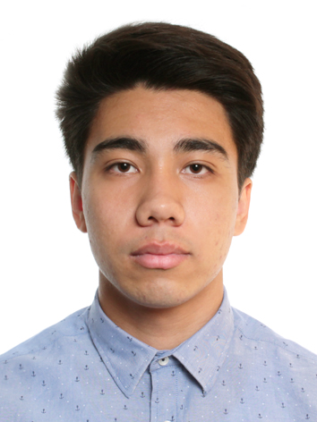

# Резюме

## Кто я?

Добрый день, меня зовут Антон Шведов, для англоязычного сообщества я использую псевдоним Alan Reid. Я проживаю в Москве и занимаюсь Фронтенд разработкой.

Я заинтересовался вебом достаточно давно: несколько лет он являлся для меня хобби, сейчас же, я на пути к статусу профессионального разработчика. За все это время я успел пережить как взлеты, так и падения, но страсть к Фронтенду не гасла во мне никогда.

Вообще, меня притягивает вся, связанная с компьютерами, отрасль и я испытываю огромное желание познать ее, параллельно своему основному пути.

## Почему я?
**Моим главным преимуществом перед многими является уверенность в своем будущем: я знаю чего я хочу, почему я этого хочу и каким образом этого добиться.** Я распланировал свою жизнь на 10 лет вперед: в моих планах открыть свою компанию, пройдя перед этим путь от junior до team lead, попутно расширив свои знания в Computer Science.

**Я не боюсь потратить время на изучение инструментов, помогающих в работе, а также, на настройку инструментов или структуры проекта, так как я понимаю, что это часть работы, тем более той, которую я люблю.** Так, я научился подстраивать [parcel bundler](https://parceljs.org/) под свои задачи ([посмотреть](https://github.com/alanreidt/range-slider-component/blob/785d4bcbb2d680be9be912120e89a8a7e15296f4/package.json#L16-L20)), изучил нестандартные возможности `git`, освоил [plop](https://plopjs.com/documentation/) для создания повторяющихся файловых структур([посмотреть](https://github.com/alanreidt/range-slider-component/blob/master/plopfile.js)) и многое другое.

**Я не довольствуюсь тем, что есть, если оно меня в чем-либо не устраивает, а начинаю искать пути сделать это лучше.** Например, перепробовав несколько приложений для планирования личных задач, я в итоге остановился на простом `markdown` файле в купе с вспомогательными приложениями. А сейчас переношу все в `Github Projects`, параллельно используя `iCloud` (`Notes`, `Remainders`, `Calendar`), `Microsoft To Do` и даже `Miro`.

## Опыт
### Май 2019 — Май 2020
Проходил [обучение по программе компании Fullstack Development](https://www.fullstack-development.com/front-end-education), параллельно подрабатывая. За это время я реализовал два проекта, произвел их рефакторинг и немного отредактировал их, согласно правкам по коду. Не стал заканчивать программу, так как прояснилось, что время, которое для этого потребуется (у ребят код-ревью стало затягиваться вплоть до 5 месяцев в среднем), несоизмеримо с размером последующей заработной платы.

#### Проекты
##### range-slider-component

Данный проект потребовал много усилий с моей стороны, в результате чего:
- Мне удалось в достаточной степени изучить MVC, а также принципы проектирования приложений в общем — теперь эта совокупность знаний помогает мне понять, какие вещи плохи и могут повлечь за собой потенциальные проблемы в будущем;
- Я на практическом опыте убедился в важности тестирования приложения, ведь это помогло мне обнаружить баги в коде, как после его рефакторинга, так и после добавления новой функциональности;
- Мне стали понятны преимущества TDD подхода разработки, а также мне удалось потренировать ход мышления, требуемый для его реализации;
- Я попрактиковался в написании Javascript кода вдоль и поперек;
- И, конечно же, я изучил еще многое другое;

##### toxin-hotel-app

Изначально данный проект был реализован на чистом HTML, CSS и JS ([посмотреть](https://github.com/alanreidt/toxin-hotel-website)), а уже в дальнейшем переписан на Svelve фреймворке.

В итоге он помог мне:
- Отточить навыки работы с макетом: отладить процесс разработки от Ui-kit до конечных страниц и научиться понимать задумку дизайнера;
- Отработать создание нетривиальных компонентов, выделение их одинаковых частей и настройку взаимодействия со сторонними библиотеками;
- Получить навыки построения многостраничных сайтов: создание правильной структуры, объединение компонентов на странице и настройку взаимодействия между ними;
- Отработать создание отзывчивого дизайна, гибкого и наиболее удобного для пользователя;
- Изучить основы работы SPA приложения и отработать перевод многостраничного сайта на него;
- Закрепить изученную теорию по Svelte на практике и получить навыки перевода обычного проекта на него;

## Что я знаю?
  - Responsive HTML/CSS
  - CSS preprocessors (LESS/SASS)
  - Javascript
  - Javascript Frameworks (React/Svelte)
  - Testing
  - Application design principles
  - MVC
  - Object-oriented programming (OOP)

## Портфолио

## Контакты
- [Telegram](https://t.me/alanreidt)
- [Gmail](mailto:alanreidt@gmail.com)
