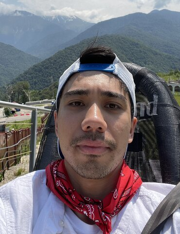

# Резюме

## Кто я?

Привет, меня зовут Антон Шведов, для англоязычного сообщества я использую псевдоним Alan Reid. Я проживаю в Москве и занимаюсь Фронтенд разработкой.

Я заинтересовался вебом достаточно давно: еще в школе развлекался над сайтом на ucoz. Около года, начиная с последнего курса института, занимался им более серьезно (в основном версткой), но все же на уровне увлечения. Потом порядка 1,5 года изучал Frontend технологии и программирование самостоятельно.

За все это время я успел пережить как взлеты, так и падения (включая перерыв на год), но страсть к Фронтенду не гасла во мне никогда.

По правде говоря, меня привлекает все, что связанно с компьютерами и я постепенно удовлетворяю свой интерес: я успел попробовать языки программирования C, Python (в рамках программы CS50), изучить основы архитектурных принципов построения приложений, ознакомиться с основными алгоритмами и структурами данных.

## Опыт
### Работа в Yandex (Июнь 2021 — текущее время)
На текущий момент я занимаюсь

### Стажировка в Yandex (Февраль 2021 — Июнь 2021)
3 месяца проходил стажировку в команде Яндекс Плюс. Моей главной задачей было написание тестовой платформы. В задачи платформы входило реализация юнит, снапшот и скриншот тестов. За это время я успел проанализировать инструменты, доступные для решения поставленных задач и выбрать наиболее подходящие. И реализовать часть функциональности с юнит и снапшот тестами. Реализацию скриншот тестов я, так же затронул, но не успел довести ее до логического завершения.

### Стажировка в Ozon Travel (Декабрь 2020 — Январь 2021)
В течение месяца проходил стажировку в компании Ozon Travel. Работа заключалась в поддержании и улучшении веб-приложения для B2B сектора. За это время успел поработать с GraphQL (им у нас занимался фронт): писал типы и обработчики для ручек сервера, а также использовал их на клиенте через GraphQL Apollo Client. Помимо этого, поработал с React, CSS Modules, работа велась по методологии Scrum.

### Самообучение в FSD (Май 2019 — Май 2020)
Проходил [самообучение по программе компании Fullstack Development](https://www.fullstack-development.com/front-end-education), параллельно подрабатывая. За это время я реализовал два проекта, произвел их рефакторинг и немного отредактировал их, согласно правкам по коду. Не стал заканчивать программу, так как прояснилось, что время, которое для этого потребуется (у ребят код-ревью стало затягиваться вплоть до 5 месяцев в среднем), несоизмеримо с размером последующей заработной платы.

#### Проекты
##### range-slider-component

Данный проект потребовал много усилий с моей стороны, в результате чего:
- Мне удалось в достаточной степени изучить MVC, а также принципы проектирования приложений в общем — теперь эта совокупность знаний помогает мне понять, какие вещи плохи и могут повлечь за собой потенциальные проблемы в будущем;
- Я на практическом опыте убедился в важности тестирования приложения, ведь это помогло мне обнаружить баги в коде, как после его рефакторинга, так и после добавления новой функциональности;
- Мне стали понятны преимущества TDD подхода разработки, а также мне удалось потренировать ход мышления, требуемый для его реализации;
- Я попрактиковался в написании Javascript кода вдоль и поперек;
- И, конечно же, я изучил еще многое другое;

##### toxin-hotel-app

Изначально данный проект был реализован на чистом HTML, CSS и JS ([посмотреть](https://github.com/alanreidt/toxin-hotel-website)), а уже в дальнейшем переписан на Svelve фреймворке.

В итоге он помог мне:
- Отточить навыки работы с макетом: отладить процесс разработки от Ui-kit до конечных страниц и научиться понимать задумку дизайнера;
- Отработать создание нетривиальных компонентов, выделение их одинаковых частей и настройку взаимодействия со сторонними библиотеками;
- Получить навыки построения многостраничных сайтов: создание правильной структуры, объединение компонентов на странице и настройку взаимодействия между ними;
- Отработать создание отзывчивого дизайна, гибкого и наиболее удобного для пользователя;
- Изучить основы работы SPA приложения и отработать перевод многостраничного сайта на него;
- Закрепить изученную теорию по Svelte на практике и получить навыки перевода обычного проекта на него;

## Портфолио

## Контакты
- [Telegram](https://t.me/antonshvedov)
- [Gmail](mailto:shvedov.a.g@yandex.ru)
